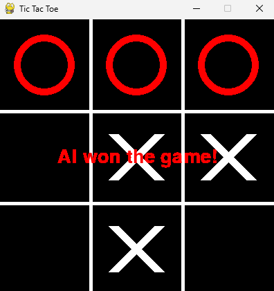
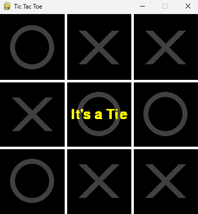

# Task 1
## Real-time Face Recognition System
### Overview
This project implements a real-time face recognition system using a pre-trained InceptionResnetV1 model from facenet_pytorch for generating face embeddings, and a Haar Cascade classifier from OpenCV for face detection. The system captures video from a webcam, detects faces in real-time, and recognizes them based on pre-stored embeddings.

### Directory Structure
```
├── pycache/
├── amma/
│ ├── image1.jpg
│ └── image2.jpg
├── appa/
│ ├── image1.jpg
│ └── image2.jpg
├── harish/
│ ├── image1.jpg
│ └── image2.jpg
├── naveen/
│ ├── image1.jpg
│ └── image2.jpg
├── .gitignore
├── face_embedding.py
├── haarcascade_frontalface_default.xml
├── main.py
└── requirements.txt
```
### Installation

1. **Clone the repository**:

    ```bash
    git clone <repository_url>
    cd <repository_directory>
    ```

2. **Install dependencies**:

    Ensure you have `pip` installed. Then, run:

    ```bash
    pip install -r requirements.txt
    ```

3. **Download Haar Cascade XML**:

    The Haar Cascade XML file for face detection is included in OpenCV. If not, you can download it from [OpenCV GitHub repository](https://github.com/opencv/opencv/tree/master/data/haarcascades).

### Usage

1. **Prepare your data**:
    - Place images of individuals in separate directories named after the individuals inside the project root directory. For example:
      ```
      .
      ├── amma/
      │   ├── image1.jpg
      │   └── image2.jpg
      ├── appa/
      │   ├── image1.jpg
      │   └── image2.jpg
      ├── harish/
      │   ├── image1.jpg
      │   └── image2.jpg
      └── naveen/
          ├── image1.jpg
          └── image2.jpg
      ```

2. **Run the face recognition system**:

    ```bash
    python main.py
    ```

    This script will preprocess the data to extract face embeddings and then start the real-time face recognition using the webcam.
   
### Demo : 


# Task 2
## Tic Tac Toe AI
### Overview
This project implements a Tic Tac Toe game with an AI opponent using Python and Pygame.
### Features:
A graphical user interface built with Pygame
Player vs AI gameplay
An unbeatable AI opponent using the Minimax algorithm with Alpha-Beta pruning
Visual feedback for game outcome
```
TicTacToeAI/
│
├── images/
│   ├── AIwon.png
│   └── Tie.png
│
├── .gitignore
├── main.py
└── requirements.txt
```
### Installation

1. **Clone the repository**:

    ```bash
    git clone <repository_url>
    cd <repository_directory>
    ```

2. **Install dependencies**:

    Ensure you have `pip` installed. Then, run:

    ```bash
    pip install -r requirements.txt
    ```
### Usage

1. **Run the game by executing** :
    ```bash
    python main.py
    ```
- Click on a cell to place your mark (X)
- The AI opponent will automatically make its move (O)
- Press 'Q' to restart the game at any time
- 
### Screenshots from the game




